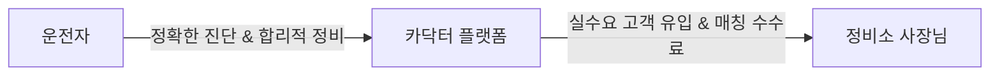

# 🚗 카닥터 (Cardoctor) — AI 정비 주치의

> **"차알못도 당당하게, 바가지는 이제 그만"**  
> 소리·냄새·느낌만 말하면 AI가 즉시 진단하고, 정비소에서 바가지 맞지 않도록 도와주는 AI 차량 케어 플랫폼 소개 페이지입니다.

---

## 📌 목차
1. [기획 의도 및 철학 (Project Philosophy)](#-기획-의도-및-철학-project-philosophy)
2. [문제 정의 (Problem Statement)](#-문제-정의-problem-statement)
3. [핵심 기능 (Core Features)](#-핵심-기능-core-features)
4. [부품 관리 (Parts Management)](#-부품-관리-parts-management)
5. [차세대 비전 (Next Version — AI Voice UX)](#-차세대-비전-next-version--ai-voice-ux)
6. [비즈니스 모델 (Business Model)](#-비즈니스-모델-business-model)
7. [개발 로드맵 (Roadmap)](#-개발-로드맵-roadmap)
8. [기술 스택 (Tech Stack)](#-기술-스택-tech-stack)
9. [개발자 소개 (Developer Info)](#-개발자-소개-developer-info)

---

## 💡 기획 의도 및 철학 (Project Philosophy)

> **"자동차는 단순한 이동 수단이 아닙니다."**  
> 가족, 연인, 친구들과 함께 소중한 추억을 쌓아가는 공간이자, 여행과 드라이브의 설렘을 전하는 매개체입니다.
> 
> 고속도로에서의 갑작스러운 차량 고장은 구동벨트, 점화플러그 같은 핵심 부품들의 방치에서 시작됩니다. 평소 잘 모른다는 이유로 무심히 그냥 지나쳤던 작은 신호들이, 때로는 생명을 위협하는 위험한 2차 사고로 이어지기도 합니다.
> 
> **사람의 생명은 그 무엇과도 바꿀 수 없기에.**  
> 조기 점검과 예방 교체를 통해 모두가 안전하고 당당하게 도로 위를 달릴 수 있도록 도우려 합니다. 저는 그래서 '카닥터'를 만들었습니다.

---

## 🔍 문제 정의 (Problem Statement)
운전자들이 정비소에서 겪는 세 가지 핵심 문제를 해결하고자 기획되었습니다.

*   **01. 🔇 증상을 설명할 수가 없다**
    *   차에서 이상한 소리나 냄새가 나도 정확한 원인을 몰라 불안해합니다.
    *   주행 중 스마트폰 검색은 위험하며, 단순 텍스트만으로는 차량 소음을 효과적으로 설명하기 어렵습니다.
*   **02. 💸 바가지를 맞는다**
    *   자동차 지식이 부족하면 정비소에서 불필요한 과잉 수리를 권유받아도 거절하기 어렵습니다.
    *   공식센터와 공임나라 간의 가격 차이가 최대 3~4배에 달해 합리적인 소비가 어렵습니다.
*   **03. ⏰ 핵심 부품을 방치한다**
    *   엔진오일이나 타이어 등 대표적인 소모품 외에 타이밍벨트, 휠 얼라이먼트 등은 비용 부담으로 교체를 미루는 경우가 많습니다.
    *   이를 방치할 경우 큰 수리비 부담 혹은 안전사고로 이어집니다.

---

## ✨ 핵심 기능 (Core Features)

| 기능 | 설명 | 비고 |
| :--- | :--- | :--- |
| **🤖 AI 증상 진단** | 소리·냄새·느낌 등으로 증상을 입력하면 AI가 즉시 원인을 분석합니다. 픽토그램 선택 및 텍스트 입력 모두 지원합니다. | 키워드 매핑 (추후 AI API 연동 예정) |
| **🛡️ 바가지 방지 카드** | AI 진단 결과를 정비소 제출용 카드 형태로 자동 생성합니다. 예상 수리비가 표시되어 과잉 정비를 방지할 수 있습니다. | 진단 결과 카드 자동 생성 |
| **📊 10만km 부품 대시보드** | 현재 주행거리 기준 핵심 부품 교체 시기를 게이지로 시각화합니다. 80% 이상 도달 시 교체 알림을 제공합니다. | 주행거리 기준 % 계산 |
| **💰 수리비 비교 계산기** | 공식 서비스센터와 공임나라의 항목별 비용을 실시간 비교하여 절약 가능 금액을 보여줍니다. | 실시간 합산 계산 |
| **🗺️ 내주변 정비소 연결** | 위치 기반 내주변 정비소를 활성화하여 앱 내에 정비소 목록을 나열해주고, 정비소 견적 버튼을 눌러 즉시 연락할 수 있습니다. | 위치 기반 / 견적 문의 |
| **🚨 불법 렉카 신고** | 사고 시 원터치 신고서 자동 생성, 녹화 및 녹음 기능, 내 권리 카드 안내, 신고 기관 직통 번호 안내를 제공합니다. | `MediaRecorder API` 연동 |

---

## ⚙️ 부품 관리 (Parts Management)
사람들이 교체 시기를 가장 자주 미루는 주요 핵심 부품 가이드라인을 제공합니다. (제네시스 G80 / 120,000km 기준 데모 데이터)

*   **점화플러그 (교체 주기: 40,000km)** - 방치 시 연비 저하, 시동 불량 위험.
*   **휠 얼라이먼트 (교체 주기: 20,000km)** - 타이어 편마모로 인한 사고 위험 및 추가 비용 발생.
*   **냉각수 (교체 주기: 40,000km)** - 엔진 과열로 인한 엔진 손상 위험.
*   **브레이크 디스크 (교체 주기: 70,000km)** - 제동 불량으로 인한 사고 위험.
*   **구동벨트 (교체 주기: 80,000km)** - 끊어질 경우 시동 불가 상태 초래.
*   **타이밍벨트 (교체 주기: 100,000km)** - 끊어질 경우 엔진 전손 위험.

---

## 🎙️ 차세대 비전 (Next Version — AI Voice UX)
*Android Auto / Apple CarPlay 연동: 운전석에서 말 한마디로 진단부터 정비소 매칭까지*

> **🔮 NEXT VERSION — 개발 예정**  
> 현재 버전에는 포함되지 않은 기능입니다

*   🎙 **DRIVER**
    *"하이 카닥터, AI 카닥터 실행해 줘. 어? 브레이크 밟을 때마다 끼익거리는 쇳소리가 나네?"*

*   🤖 **AI 카닥터**
    *"네, 오너님. 현재 차량 하부에서 불규칙한 마찰음이 감지되었습니다. 최근 브레이크 패드 교체 주기가 지난 상태인데, 브레이크 패드 마모가 의심됩니다."*
    > ⚡ 차량 내장 마이크 → 실시간 소음 주파수 분석 → 차량 정비 이력 교차 분석

*   🤖 **AI 카닥터**
    *"오너님의 안전한 주행을 위해, 현재 주행 경로에서 가장 가까운 브레이크 전문 정비소 사장님들과 바로 상담을 연결해 드릴까요?"*

*   🎙 **DRIVER**
    *"어, 연결해 줘."*

*   ✅ **ACTION**
    하이패스 방식으로 AI 진단 리포트(소음 데이터 + 의심 증상)가 인근 정비소 POS로 즉시 전송  
    → 차량 스피커폰으로 사장님과 실시간 전화/채팅 상담 연결

---

## 📈 비즈니스 모델 (Business Model)
단순한 광고 플랫폼이 아닌, **AI 1차 진단이 완료된 실수요 고객을 정비소와 매칭**하여 상생하는 생태계를 구축합니다.

*   **운전자**: 바가지 없는 투명한 정비 및 수리비 절약
*   **정비소**: 불필요한 마케팅 비용 절감, 예약률 및 매출 상승
*   **카닥터**: 매칭 플랫폼 수수료 기반의 지속 가능한 비즈니스 모델

---

## 🗺️ 개발 로드맵 (Roadmap)

*   **PHASE 1 (현재) — 포트폴리오 버전**
    *   React 기반의 프론트엔드 UI/UX 완성
    *   키워드 매핑형 AI 진단 및 localStorage 데이터 관리 구현
    *   렉카 신고 기능 및 수리비 비교 계산기 구축
*   **PHASE 2 — 수도권 테스트 및 실서비스 런칭**
    *   실제 LLM/AI API 연동 고도화 및 정비소 DB 구축
    *   **위치 서비스 및 주소 등록 기반 매칭**: 사용자 위치 반경 10km 이내의 정비소 목록 UI 구현
    *   **정비소 견적 및 원가 비교 시스템**: 실시간 견적 대조를 통한 합리적 소비 기능 제공
    *   지도 API 연동 및 매칭 수수료 정산 모델 검증
*   **PHASE 3 — 스케일업 및 CarPlay 연동**
    *   Android Auto 및 Apple CarPlay용 앱 런칭
    *   차량 실시간 사운드 분석 엔진 탑재
    *   오프라인 정비소 POS 시스템과의 실시간 API 연동

---

## 🛠️ 기술 스택 (Tech Stack)
*   **Core**: React 18
*   **Styling**: CSS Variables (Custom Design System)
*   **State / Data**: localStorage, HTML5 Context API
*   **APIs & Hardware**: MediaRecorder API (음성/영상 녹화), 위치 기반 API (내주변 정비소 나열 및 연락)
*   **Design & UI**: Responsive Web (모바일 최적화), Noto Sans KR, Roboto Mono

---

## 👨‍💻 개발자 소개 (Developer Info)
*   **이름**: 조진훈 (Frontend Developer)
*   **프로필**: 
    *   자동차학과 출신 및 세차장 현업 운영/경험 보유.
    *   현장의 애로사항과 고객의 니즈를 직접 겪은 후, IT 기술을 접목하여 기획하고 제작한 해결책입니다.

---

# 🏛️ [카닥터] 정비소 탐색 및 견적 요청 UX/UI 개선 기획서

## 1. 개요 및 배경
* **서비스:** 카닥터 (자동차 정비 및 관리 플랫폼)
* **기획 목적:** 불명확한 버튼 명칭과 분산된 탐색 동선을 직관적인 **위치 기반(GPS) 탐색 및 견적 연결 구조**로 재설계하여 유저 이탈률을 낮추고 견적 전환율(CR)을 극대화함.

---

## 2. 현상 및 문제점 분석 (As-Is)

### 🔴 문제점
* **타사 브랜드 명칭 노출로 인한 혼란**
  * 메인 UI 상에 `카카오정비소`, `네이버정비소` 등 타사 명칭이 무분별하게 혼용되어 유저에게 서비스 정체성에 대한 혼란을 야기함.
* **복잡한 정비소 탐색 동선**
  * 직관적인 "내 주변" 중심의 탐색 체계가 부족하여 정비소를 한눈에 비교하고 선택하기 어려움.
* **전환(Conversion) 버튼의 가시성 부족**
  * 정비소 탐색 후 실제 견적 문의나 연락으로 이어지는 핵심 CTA(Call to Action) 동선이 매끄럽지 못함.

---

## 3. 개선 방향 및 UX 동선 설계 (To-Be)

### 🟢 핵심 개선 포인트
1. **명칭 및 탭 직관화:** 불필요한 타사 브랜드 버튼을 폐지하고 **`내 주변 정비소`** 단일 명칭으로 일원화.
2. **위치 기반 자동 리스트업:** 유저 GPS 좌표를 기반으로 근거리 정비소를 우선 노출.
3. **원클릭 견적 요청:** 정비소 카드 및 상세 페이지 내 `견적 요청 / 전화 연결` 버튼을 고정(Sticky)배치.

---

### 🔄 개선된 유저 탐색 프로세스

**[ 1. 내 주변 정비소 탐색 ]** ➔ **[ 2. 정비소 상세 정보 확인 ]** ➔ **[ 3. 견적 요청 및 전화 연결 ]**

---

## 4. 세부 화면 구성 및 기능 요구사항 (PRD)

| 구분 | 주요 변경 사항 | 기능 사양 및 UX 상세 |
| :--- | :--- | :--- |
| **메인 UI** | 버튼 명칭 변경 | `카카오정비소` / `네이버정비소` ➔ **`내 주변 정비소`** 통합 |
| **정비소 리스트** | GPS 기반 나열 | - 현 위치 기준 거리(km) 표시 - 영업 여부, 평점, 작업 후기 수 한눈에 제공 |
| **상세/견적 UI** | CTA 버튼 강화 | - 하단 Sticky 바 형태로 **`[견적 요청]` / `[전화 연결]`** 상시 노출 - 탭 한 번으로 이미지 첨부 및 견적 문의 양식 진입 |

---

## 5. 기대 효과

* **유저 신뢰도 제고:** 카닥터 자체 브랜딩 강화 및 불필요한 타사 이동 감쇄.
* **사용성(Usability) 향상:** 위치 기반 3단계 즉시 탐색으로 유저 탐색 피로도 최소화.
* **비즈니스 매출 증대:** 견적 및 전화 연결 접근성을 높여 제휴 정비소 매칭 건수 폭발적 증가.

---

# 🏛️ [카닥터 / 세차의 정석] 외제차 정밀 견적 및 평가 기반 상위 랭킹 시스템 기획서

## 1. 업데이트 개요
* **기획 배경:** 수입차 정비 시장의 정보 불균형(바가지 요금, 기술력 미검증)을 해소하고, 실력 있는 정비소의 매출을 극대화하는 선순환 구조 구축.
* **핵심 목표:** 
  1. 외제차 전문 정비소 연계 정밀 견적 프로세스 도입
  2. 관리자 페이지 기반의 리뷰/별점 알고리즘 구축을 통한 양심·실력 업체 상위 랭킹화

---

## 2. 신규 기능 및 시스템 구조 (To-Be)

### 🚗 [사용자 단] 외제차 정밀 견적 기능
* **외제차 전담 카센타 카테고리 신설:** 브랜드별/차종별 전문 정비소 필터링 제공.
* **정밀 견적 요청 CTA:** 차량 증상 및 파손 부위 사진 첨부 ➔ 수입차 전문 카센타 다이렉트 매칭.

### ⚙️ [관리자 단] Admin 페이지 & 랭킹 알고리즘
* **어드민 관리자 페이지 구축:** 
  * 업체별 실시간 리뷰, 별점, 견적 응답률 데이터 모니터링.
  * 어뷰징(거짓 리뷰, 별점 테러) 검증 및 정비소 상태 관리.
* **실력/가성비 기반 상위 랭크 시스템:**
  * 단순히 광고비를 많이 낸 업체가 아닌, **`실제 이용자 평점 + 정밀 견적 만족도 + 가격 합리성`** 종합 점수가 높은 정비를 리스트 최상단에 자동 배치.

---

## 3. 유저 & 정비소 프로세스 (Flow)   

---

## 4. 기대 효과 (Business Impact)

1. **정비소 측면 (B2B):** 
   - 마케팅 능력이 부족해도 실력과 양심만 있다면 플랫폼 상위 노출을 통해 **신규 고객 확보 및 매출 폭발적 극대화**.
2. **사용자 측면 (B2C):** 
   - 외제차 수리비 덤탱이 공포 해소 및 검증된 전문 업체 매칭으로 **서비스 신뢰도 상승**.
3. **플랫폼 측면 (Platform):** 
   - 고관여 수입차 유저 락인(Lock-in) 및 우수 제휴 정비소 네트워크 독점 확보.
