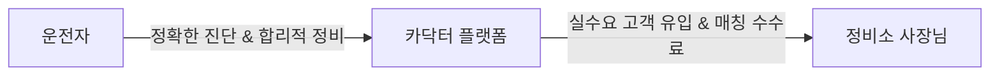

# 🚗 카닥터 (Cardoctor) — AI 정비 주치의

> **"차알못도 당당하게, 바가지는 이제 그만"**  
> 소리·냄새·느낌만 말하면 AI가 즉시 진단하고, 정비소에서 바가지 맞지 않도록 도와주는 AI 차량 케어 플랫폼 소개 페이지입니다.

---

## 📌 목차
1. [기획 의도 및 철학 (Project Philosophy)](#-기획-의도-및-철학-project-philosophy)
2. [문제 정의 (Problem Statement)](#-문제-정의-problem-statement)
3. [핵심 기능 (Core Features)](#-핵심-기능-core-features)
4. [부품 관리 (Parts Management)](#-부품-관리-parts-management)
5. [차세대 비전 (Next Version — AI Voice UX)](#-차세대-비전-next-version--ai-voice-ux)
6. [비즈니스 모델 (Business Model)](#-비즈니스-모델-business-model)
7. [개발 로드맵 (Roadmap)](#-개발-로드맵-roadmap)
8. [기술 스택 (Tech Stack)](#-기술-스택-tech-stack)
9. [개발자 소개 (Developer Info)](#-개발자-소개-developer-info)

---

## 💡 기획 의도 및 철학 (Project Philosophy)

> **"자동차는 단순한 이동 수단이 아닙니다."**  
> 가족, 연인, 친구들과 함께 소중한 추억을 쌓아가는 공간이자, 여행과 드라이브의 설렘을 전하는 매개체입니다.
> 
> 고속도로에서의 갑작스러운 차량 고장은 구동벨트, 점화플러그 같은 핵심 부품들의 방치에서 시작됩니다. 평소 잘 모른다는 이유로 무심히 그냥 지나쳤던 작은 신호들이, 때로는 생명을 위협하는 위험한 2차 사고로 이어지기도 합니다.
> 
> **사람의 생명은 그 무엇과도 바꿀 수 없기에.**  
> 조기 점검과 예방 교체를 통해 모두가 안전하고 당당하게 도로 위를 달릴 수 있도록 도우려 합니다. 저는 그래서 '카닥터'를 만들었습니다.

---

## 🔍 문제 정의 (Problem Statement)
운전자들이 정비소에서 겪는 세 가지 핵심 문제를 해결하고자 기획되었습니다.

*   **01. 🔇 증상을 설명할 수가 없다**
    *   차에서 이상한 소리나 냄새가 나도 정확한 원인을 몰라 불안해합니다.
    *   주행 중 스마트폰 검색은 위험하며, 단순 텍스트만으로는 차량 소음을 효과적으로 설명하기 어렵습니다.
*   **02. 💸 바가지를 맞는다**
    *   자동차 지식이 부족하면 정비소에서 불필요한 과잉 수리를 권유받아도 거절하기 어렵습니다.
    *   공식센터와 공임나라 간의 가격 차이가 최대 3~4배에 달해 합리적인 소비가 어렵습니다.
*   **03. ⏰ 핵심 부품을 방치한다**
    *   엔진오일이나 타이어 등 대표적인 소모품 외에 타이밍벨트, 휠 얼라이먼트 등은 비용 부담으로 교체를 미루는 경우가 많습니다.
    *   이를 방치할 경우 큰 수리비 부담 혹은 안전사고로 이어집니다.

---

## ✨ 핵심 기능 (Core Features)

| 기능 | 설명 | 비고 |
| :--- | :--- | :--- |
| **🤖 AI 증상 진단** | 소리·냄새·느낌 등으로 증상을 입력하면 AI가 즉시 원인을 분석합니다. 픽토그램 선택 및 텍스트 입력 모두 지원합니다. | 키워드 매핑 (추후 AI API 연동 예정) |
| **🛡️ 바가지 방지 카드** | AI 진단 결과를 정비소 제출용 카드 형태로 자동 생성합니다. 예상 수리비가 표시되어 과잉 정비를 방지할 수 있습니다. | 진단 결과 카드 자동 생성 |
| **📊 10만km 부품 대시보드** | 현재 주행거리 기준 핵심 부품 교체 시기를 게이지로 시각화합니다. 80% 이상 도달 시 교체 알림을 제공합니다. | 주행거리 기준 % 계산 |
| **💰 수리비 비교 계산기** | 공식 서비스센터와 공임나라의 항목별 비용을 실시간 비교하여 절약 가능 금액을 보여줍니다. | 실시간 합산 계산 |
| **🗺️ 정비소 길안내 연동** | AI 진단 완료 후, 바가지 방지 카드 하단에서 카카오맵·네이버지도 앱으로 가까운 정비소 경로를 바로 찾을 수 있습니다. | 딥링크 연동 |
| **🚨 불법 렉카 신고** | 사고 시 원터치 신고서 자동 생성, 녹화 및 녹음 기능, 내 권리 카드 안내, 신고 기관 직통 번호 안내를 제공합니다. | `MediaRecorder API` 연동 |

---

## ⚙️ 부품 관리 (Parts Management)
사람들이 교체 시기를 가장 자주 미루는 주요 핵심 부품 가이드라인을 제공합니다. (제네시스 G80 / 120,000km 기준 데모 데이터)

*   **점화플러그 (교체 주기: 40,000km)** - 방치 시 연비 저하, 시동 불량 위험.
*   **휠 얼라이먼트 (교체 주기: 20,000km)** - 타이어 편마모로 인한 사고 위험 및 추가 비용 발생.
*   **냉각수 (교체 주기: 40,000km)** - 엔진 과열로 인한 엔진 손상 위험.
*   **브레이크 디스크 (교체 주기: 70,000km)** - 제동 불량으로 인한 사고 위험.
*   **구동벨트 (교체 주기: 80,000km)** - 끊어질 경우 시동 불가 상태 초래.
*   **타이밍벨트 (교체 주기: 100,000km)** - 끊어질 경우 엔진 전손 위험.

---

## 🎙️ 차세대 비전 (Next Version — AI Voice UX)
*Android Auto 및 Apple CarPlay 탑재를 겨냥한 차세대 모빌리티 음성 진단 비전입니다.*

1.  **드라이버**: *"어? 이상한 소리가 나네? 하이 카닥터, AI 카닥터 실행해 줘."*
2.  **AI 카닥터**: 차량 내장 마이크를 통해 실시간 소음 주파수를 분석하고 기존 정비 이력을 확인하여 의심 증상(예: 브레이크 패드 마모)을 진단합니다.
3.  **AI 카닥터**: 운전자의 현재 위치에서 가장 가까운 정비소와 상담 연결 여부를 묻습니다.
4.  **드라이버**: *"어, 연결해 줘."*
5.  **연결 및 전송**: 진단 리포트(소음 데이터 + 의심 증상)가 인근 정비소 POS로 즉시 전송되고, 차량 스피커폰을 통해 실시간 전화/채팅 상담이 연결됩니다.

---

## 📈 비즈니스 모델 (Business Model)
단순한 광고 플랫폼이 아닌, **AI 1차 진단이 완료된 실수요 고객을 정비소와 매칭**하여 상생하는 생태계를 구축합니다.

*   **운전자**: 바가지 없는 투명한 정비 및 수리비 절약
*   **정비소**: 불필요한 마케팅 비용 절감, 예약률 및 매출 상승
*   **카닥터**: 매칭 플랫폼 수수료 기반의 지속 가능한 비즈니스 모델

---

## 🗺️ 개발 로드맵 (Roadmap)

*   **PHASE 1 (현재) — 포트폴리오 버전**
    *   React 기반의 프론트엔드 UI/UX 완성
    *   키워드 매핑형 AI 진단 및 localStorage 데이터 관리 구현
    *   렉카 신고 기능 및 수리비 비교 계산기 구축
*   **PHASE 2 — 수도권 테스트 및 실서비스 런칭**
    *   실제 LLM/AI API 연동 고도화
    *   전국/수도권 정비소 데이터베이스(DB) 구축
    *   지도 API 및 매칭 수수료 정산 모델 검증
*   **PHASE 3 — 스케일업 및 CarPlay 연동**
    *   Android Auto 및 Apple CarPlay용 앱 런칭
    *   차량 실시간 사운드 분석 엔진 탑재
    *   오프라인 정비소 POS 시스템과의 실시간 API 연동

---

## 🛠️ 기술 스택 (Tech Stack)
*   **Core**: React 18
*   **Styling**: CSS Variables (Custom Design System)
*   **State / Data**: localStorage, HTML5 Context API
*   **APIs & Hardware**: MediaRecorder API (음성/영상 녹화), 카카오맵/네이버지도 딥링크 (길안내)
*   **Design & UI**: Responsive Web (모바일 최적화), Noto Sans KR, Roboto Mono

---

## 👨‍💻 개발자 소개 (Developer Info)
*   **이름**: 조진훈 (Frontend Developer)
*   **프로필**: 
    *   자동차학과 출신 및 세차장 현업 운영/경험 보유.
    *   현장의 애로사항과 고객의 니즈를 직접 겪은 후, IT 기술을 접목하여 기획하고 제작한 해결책입니다.
